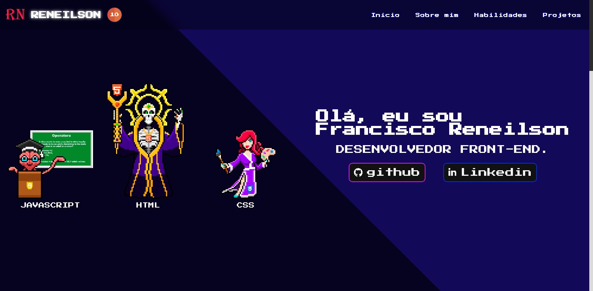
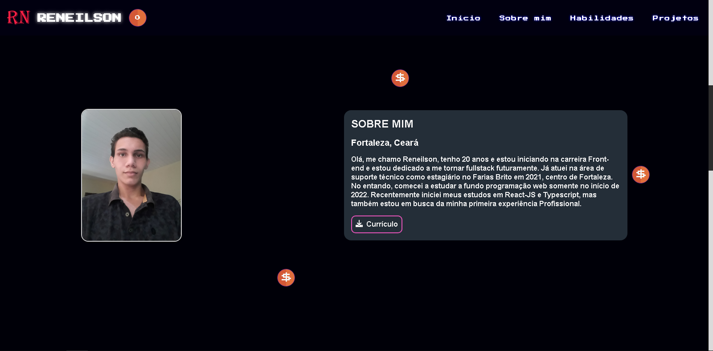
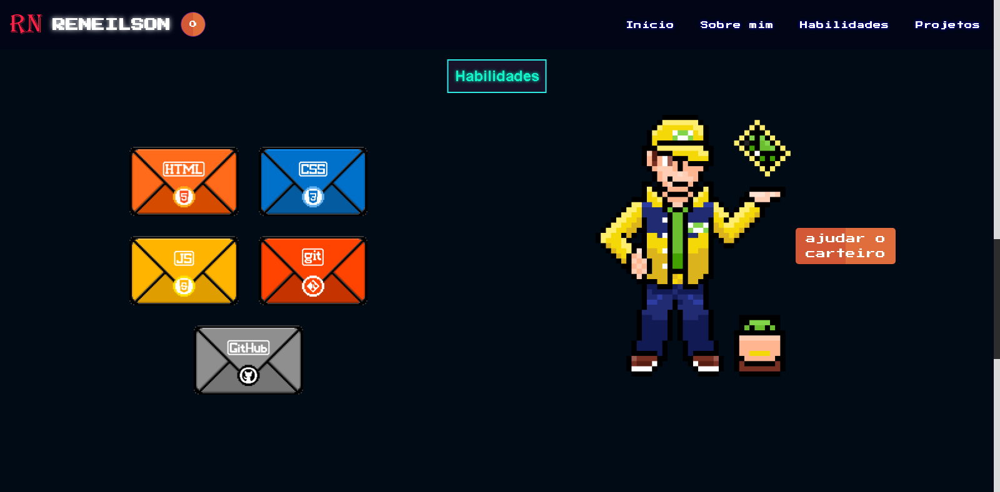
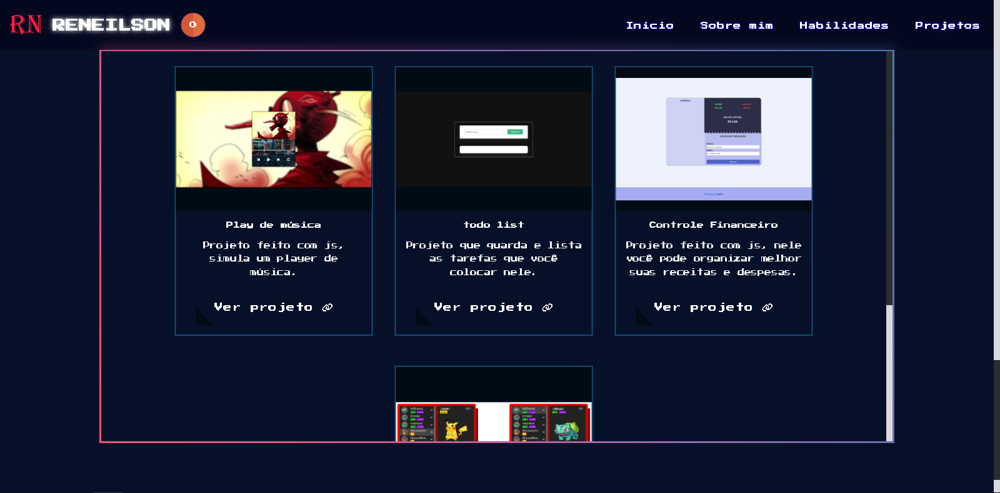
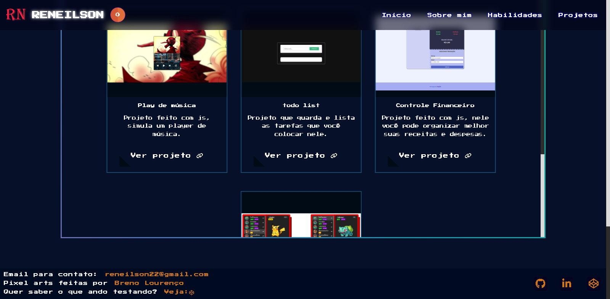

<h1 align=center>Portfólio de Reneilson</h1>

  
  
  
  

  
  
  
  
  

<h3>Contato</h3>

  <a href="mailto:reneilson22@gmail.com" style="font-size: 24px;" target="_black">reneilson22@gmail.com</a>

  
ou

  
  
  
  

<h2>Descrição</h2>

Essa aplicação foi criada para mostrar um pouco sobre mim e minhas habilidades com programação web. Estarei atualizando os projetos conforme eu me aprimoro. bom proveito. :)

<h2>Artista das pixel arts</h2>

<a href="https://github.com/breno05s" style="font-size: 24px;" target="_blank">Breno Lourenço</a>

<b>Por gentileza, não utilizar as artes presentes neste projeto sem a autorização do autor.</b>